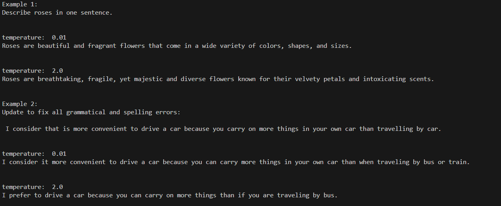

# Overview
This is the repository to the "Evaluating Large Language Models for Psychological Research" project.
We provide all codes, data, and instructions to replicate the examples shown in the paper. We further provide the exact prompts as well as model parameters and the instructions to replicate our python programming environment.

## Data
No external data is necessary for replicating the examples shown in the paper. They require only prompting the model as shown in the code files and using the same model parameters.

We provide the files `requirements.txt` and `environment.yaml` to reproduce the python environment using pip and conda.

## Code files
We provide a single python script (`replication.py`) that contains the prompts, model settings, and LLM queries. 

## LLM details
We used the opensource LLaMA-3.1 model, specifically a 4bit quantized version from huggingface:
[hugging-quants/Meta-Llama-3.1-8B-Instruct-AWQ-INT4](url). 

# Instructions for replication
## Setting up the python environment
- Download this repository. If using git from the command line run: `git clone https://github.com/goytoom/llm_psychology_guide`
- In the command line run `conda env create --file environment.yml` (this will create a virtual programming environment with the required python version)
- In the command line run `conda activate replication` (activate the environment)
- In the command line run `pip install -r requirements.txt` (this will install the necessary packages in this environment)

## Executing the replication
- In the command line run `conda activate replication` to activate the python programming environment
- Run the replication script in the command line: `python replication.py`

This should output the prompts used in the example and the model's response:

